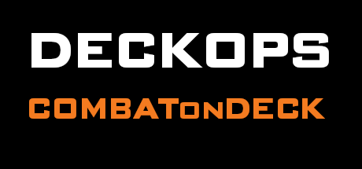

# DeckOps

  

  Bringing the Golden Age of FPS to your Steam Deck, no tinkering required.

---

DeckOps automates the installation of CoD4x, IW3SP-MOD, iw4x, T6SP-Mod, and Plutonium on Steam Deck. Pick your games, hit install, and launch them straight from Steam like any other game.

> Want to test experimental features? Check out [DeckOps Nightly](https://github.com/GalvarinoDev/DeckOps-Nightly). It is unstable and not recommended for everyday use.

---

## 🎮 Supported Games

| Game | Mode | Client | Online | Aim Assist | Gyro |
|---|---|---|---|---|---|
| Modern Warfare | SP | [IW3SP-MOD](https://gitea.com/JerryALT/iw3sp_mod) | No | ✅ | ✅ |
| Modern Warfare | MP | [CoD4x](https://cod4x.ovh) | LCD + OLED | ❌ | ✅ |
| Modern Warfare 2 | SP | — | No | ❌ | ✅ |
| Modern Warfare 2 | MP | [iw4x](https://iw4x.io) | LCD + OLED | ✅ | ✅ |
| Modern Warfare 3 | SP | — | No | ❌ | ✅ |
| Modern Warfare 3 | MP | [Plutonium](https://plutonium.pw) | OLED | ✅ | ✅ |
| World at War | SP + ZM | [Plutonium](https://plutonium.pw) | OLED | ✅ | ✅ |
| World at War | MP | [Plutonium](https://plutonium.pw) | OLED | ✅ | ✅ |
| Black Ops | SP + ZM | [Plutonium](https://plutonium.pw) | OLED | ✅ | ✅ |
| Black Ops | MP | [Plutonium](https://plutonium.pw) | OLED | ✅ | ✅ |
| Black Ops II | SP | [T6SP-Mod](https://github.com/Rattpak/T6SP-Mod-Release) ¹ | No | ❌ | ✅ |
| Black Ops II | ZM | [Plutonium](https://plutonium.pw) | OLED | ✅ | ✅ |
| Black Ops II | MP | [Plutonium](https://plutonium.pw) | OLED | ✅ | ✅ |

> Plutonium online servers require an OLED Steam Deck. LCD users can play all Plutonium titles offline in LAN mode, including Multiplayer with bots. DeckOps handles this automatically.

> All titles support controller and gyro via Steam Input. During setup, choose your gyro style: **Hold** (R5 held), **ADS** (gyro activates when you aim down sights), or **Toggle** (R5 press). Aim assist is unavailable for MW1 MP, MW2 SP, MW3 SP, and BO2 SP.

> ¹ Not yet implemented. BO2 SP currently launches through vanilla Steam. T6SP-Mod support will be added once the developer confirms it is ready to ship.

---

## ⚠️ Before You Install
Before running DeckOps, launch each game through Steam in every mode that has a custom client shown in the table above. This creates the folders needed and starts shader cache downloads. Skipping this is the most common cause of install failures.

Plutonium online play requires a [free account](https://forum.plutonium.pw/register) and an OLED Steam Deck. LCD users do not need a Plutonium account. DeckOps automatically launches all Plutonium games in offline LAN mode on LCD.

---

## 💾 Installation & Uninstall

1. Press the Steam button -> **Power** -> **Switch to Desktop**
2. Open a browser and navigate to this GitHub page
3. Download the **[DeckOps file](https://github.com/GalvarinoDev/DeckOps/releases/download/v1/DeckOps.desktop)**
4. Right-click the file -> **Properties** -> **Permissions** -> tick **"Is executable"** -> OK
5. Double-click it
   - **First time:** DeckOps installs automatically
   - **Already installed:** A menu appears - choose to Launch, Reinstall, or Uninstall

*Example of the alpha build during install, more features have been added but ease of install remains the same.*

> Your Steam games are never touched. Only files created by DeckOps are removed during uninstall.

---

## ⚠️ After Installation

**Click Continue when installation finishes, DeckOps will reopen Steam automatically.** Launch every modded game at least once before using Steam in Desktop Mode, or Steam Cloud will overwrite your setup. If asked about cloud saves choose **Keep Local**. If asked about launching in safe mode or changing your settings due to a hardware change choose **No**.

- **MW1 & WaW:** Steam will ask which mode to launch on first run. Select Singleplayer or Campaign and set it as your default. Multiplayer for these games launches via the DeckOps created shortcuts in your library instead.
- **MW1 SP** On first launch, the game will ask you to select a profile. Choose **Player**, this is the profile DeckOps created with your display settings. Creating a new profile will use default settings instead.
- **MW1 MP** requires two Steam launches to finish setup, then runs normally on the third.
- **BO2 SP** display settings must be set manually in-game. MP and ZM are configured automatically.
- The latest GE-Proton is downloaded and set automatically for all games.
- XACT audio is installed automatically via Protontricks for WaW and BO1 SP/MP.

---

## 🎮 Gyro Controls

DeckOps installs a custom controller profile for every game. During setup you choose one of three gyro schemes, you can change this anytime in **Settings → Re-apply Controller Profiles**.

| Scheme | How it works |
|---|---|
| **Hold** | Gyro is active while R5 (right grip) is held down |
| **ADS** | Gyro activates when you aim down sights |
| **Toggle** | Press R5 once to turn gyro on, press again to turn it off |

MW1 MP, MW2 SP, and MW3 SP handle gyro differently due to controller support added via Steam input.

---

## 🛠️ My Games Screen

The My Games screen shows every supported game and its current status. From here you can:

- **Set Up** - run the install wizard for a game that is installed but not yet set up
- **Update / Reinstall** - re-download and reinstall the mod client for a game already set up
- **Open Folder** - open the game's install directory in the file manager, useful for manual modding or troubleshooting
- **Install on Steam** - opens the Steam store page for games not yet in your library

---

## ⚙️ Settings

| Option | What it does |
|---|---|
| Background Music | Toggle/adjust volume |
| Reset Credentials | Clear your Plutonium login |
| Sync to All Prefixes | Copy your Plutonium login to all games |
| Re-apply Controller Profiles | Re-apply your chosen controller to all games |
| Repair Shortcuts | Recreate non-Steam shortcuts for CoD4 MP and WaW MP |
| Re-apply Game Configs | Re-write display configs for all set-up games |
| Full Uninstall | Remove everything DeckOps installed |
| Reset DeckOps Config | Wipe DeckOps config and run setup again |

---

## 🔧 Troubleshooting

https://discord.gg/bkSQeq5Azk

## Credits

DeckOps is an installer. This project wouldn't exist without the years of foundational work from these teams. They truly deserve all the credit:

**[CoD4x](https://cod4x.ovh)** - Modern Warfare 1 Multiplayer client. [GitHub](https://github.com/callofduty4x)

**[IW3SP-MOD](https://gitea.com/JerryALT/iw3sp_mod)** - Modern Warfare 1 Singleplayer client by [JerryALT](https://gitea.com/JerryALT).

**[iw4x](https://iw4x.io)** - Modern Warfare 2 Multiplayer client. [GitHub](https://github.com/iw4x)

**[T6SP-Mod](https://github.com/Rattpak/T6SP-Mod-Release)** - Black Ops II Singleplayer client by [Rattpak](https://github.com/Rattpak).

**[Plutonium](https://plutonium.pw)** - Modern Warfare 3, World at War, Black Ops, and Black Ops II client. 💰 [Donate](https://forum.plutonium.pw/donate)

---
**[PlutoniumAltLauncher](https://github.com/framilano/PlutoniumAltLauncher)** - Inspiration for DeckOps.

**[LanLauncher](https://github.com/JugAndDoubleTap/LanLauncher)** - Inspiration for LCD offline LAN mode.

Steam artwork from [SteamGridDB](https://www.steamgriddb.com) - thanks to [Moohoo](https://www.steamgriddb.com/profile/76561198009314736), [jarvis](https://www.steamgriddb.com/profile/76561198103947979), [Ramjez](https://www.steamgriddb.com/profile/76561198122547176), [Over](https://www.steamgriddb.com/profile/76561198049670875), [Uravity-PRO](https://www.steamgriddb.com/profile/76561198167607660), [Maxine](https://www.steamgriddb.com/profile/76561198130550992), [caukyy](https://www.steamgriddb.com/profile/76561198031582867), [Middle](https://www.steamgriddb.com/profile/76561198027273869), [Hevi](https://www.steamgriddb.com/profile/76561198018073166), [europeOS](https://www.steamgriddb.com/profile/76561198038608428), [Empti](https://www.steamgriddb.com/profile/76561198022992095), [grimlokk](https://www.steamgriddb.com/profile/76561199034037601), [Mr.Parks](https://www.steamgriddb.com/profile/76561198018403239), [Dankheili](https://www.steamgriddb.com/profile/76561198040056867), [FaN](https://www.steamgriddb.com/profile/76561198015449572), [adamboulton](https://www.steamgriddb.com/profile/76561198143575007), [ActualCj](https://www.steamgriddb.com/profile/76561198135110632), [KimaRo](https://www.steamgriddb.com/profile/76561197985524535), [Gector(lint)Nathan](https://www.steamgriddb.com/profile/76561198319864298), and [increasing](https://www.steamgriddb.com/profile/76561198041593264).

**[Claude](https://claude.ai)** by Anthropic - assisted in development.

---

> DeckOps is not affiliated with Activision, Infinity Ward, Treyarch, or Valve. All trademarks belong to their respective owners. A legitimate Steam copy of each game is required. DeckOps does not provide or distribute game files.

## License

[MIT License](LICENSE)
